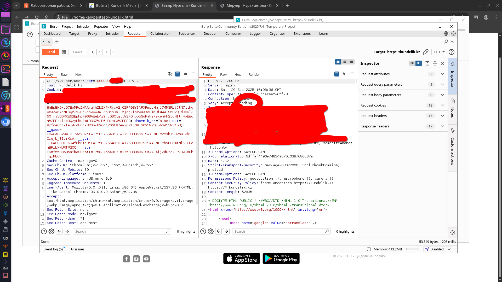
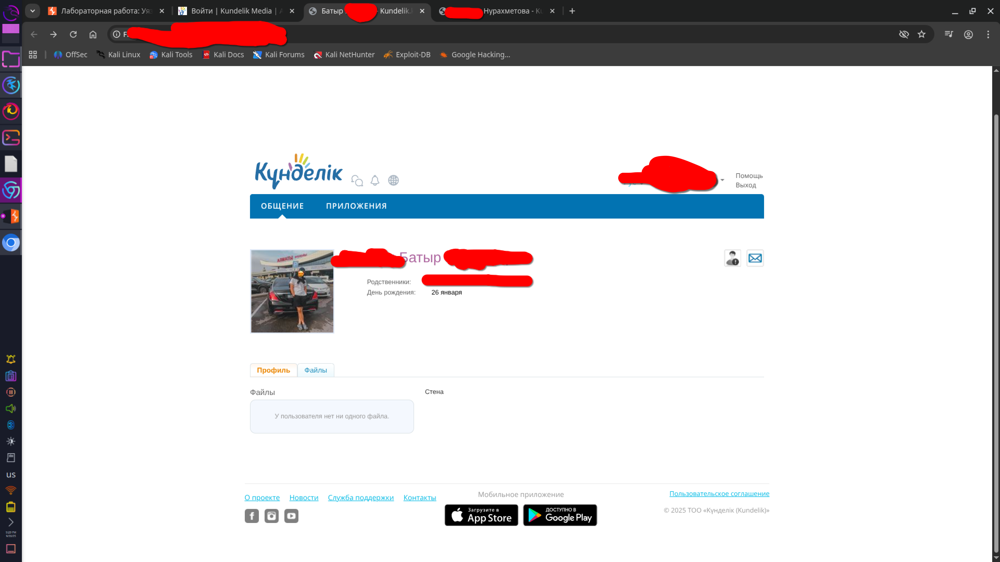
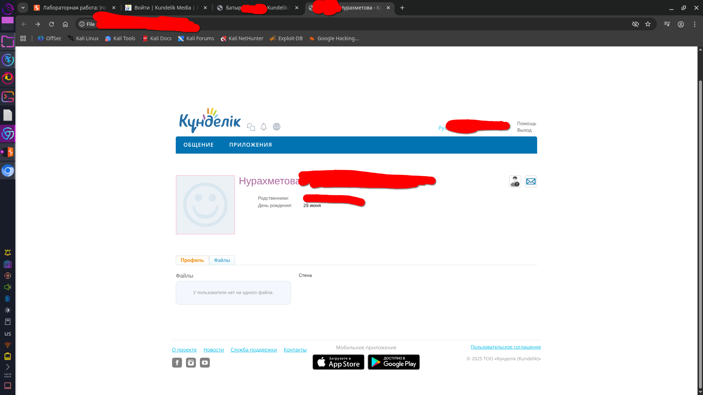

# kundelik
уязвимость это не зеродэй оказывег в кунделик почти полноценный idor

# вот история 
сижу я в бурпсуит и решил проверить kundelik.kz на веб узявимости

проверил и нашел почти целый idor но он не целый 
я могу видить ФИО учеников или учитилей также ФИО их родсвенников
не полноценный idor это значит что я могу видить ФИО ученика и его родственника но не могу открыть в браузере так как нужно куки и так я могу открыть только локально
и я думаю что это может быть критично 
ведь так можно шантажировать людей 
вот скрин из burp 

там замазаны userid, куки и другие данные 
и вот скрин пользователей
там также замазаны ФИО и данные 

